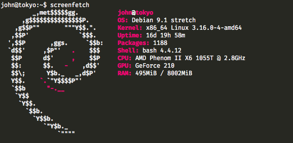

# homelab-stack
A short description of what I have currently running on my homelab, how to set it up, and why I chose it.

## Why run a homelab?

To be honest, my first stretch at actually *running* a homelab was through a highschool co-op experience I had. I was forced to learn how to use Linux (specifically Ubuntu) and delve deep into what the command line had to offer me. After this experience, and a bit of browsing HackerNews, I realized a lot of the services I was paying for could be done at home and for free (neglecting hydro of course). 

So began my journey into the world of homelabbing. 


## What I'm running my homelab on!

I'm currently using one of my family member's old desktop computers as a server, at least until I can afford better hardware.

Here's screenfetch result!



## What am I running on my homelab?

### Debian 9.1 (stretch)

Debian seemed like the most logical jump from Ubuntu, as it provided me stability without forcing me to adapt to new tooling. I tried CRUX and Arch Linux beforehand, and found them to be either lacking in features, or unstable, especially when compared ot Debian. 

### Caddy

Caddy is honestly the best thing that's probably ever happened to me. It cut down my 75 lines of NGINX configuration files to a solid 15 (it's 33 now, but that was before my other projects were added). There was also a problem with certbot-auto & NGINX I encountered mid-2017 that still hasn't been resolved. Meanwhile Caddy includes automatic HTTPS, and HTTP/2.0 right out of the box! It's also written in my language of choice (Go), making it even more of a fit for me. 

#### Installation

Installation is a breeze, all you need to do is type ```curl https://getcaddy.com/ | bash``` and you're done!

To add plugin support for such things as AWS and Git hooks, you must instead go to https://caddyserver.com/download and add 
your requested plugins (you can still use curl!). 

Once installed, I find that storing all Caddy-related files in ```/etc/caddy``` is the best practice. 

#### Configuration

Configuration is done in what's known as a Caddyfile, and follows NGINX-like syntax. My full configuration is found [here!]() 

#### Deployment

I choose to not run Caddy as a systemd service (for easier use when I move to something without it), so I instead just type two commands whenver I want to restart my server:
```bash
$ sudo pkill caddy
$ sudo nohup sudo caddy &
```
While admittedly not pretty, it gets the job done and also provides easy to view logging information!

### johnoss.com

I had written this website in early 2016 to both fill the empty void that was my domain, and to help secure my way into the University of Waterloo! I used BassCSS/Normalize.css/FontAwesome for styling, after being inspired by a Dieter Rams book I had read that day. I haven't really edited much since, though a redesign is coming up in the near future!

Since this is a static webpage, installation is covered in my Caddyfile!

### The Lounge

[The Lounge](https://thelounge.github.io) is a beautifully made, web-based IRC client / bouncer. I had used WeeChat before to talk to my coworkers who refused to use Slack, but gave up after missing out on entire, relatively important conversations. The Lounge prevents this by constantly having a session attached to the IRC server, so I can close my browser without having to log out of IRC.

#### Installation

This requires Docker to use, and once installed is pretty easy to setup.

```bash
$ docker pull thelounge/lounge
$ docker run --d \
        --name lounge \
        --publish 9000:9000 \
        --volume ~/.lounge:/home/lounge/data \
        --restart always \
        thelounge/lounge:latest
```

This launches a Lounge instance on port 9000, with the volume storing chat logs! If you're having trouble running this, you may need to use ```sudo docker``` instead. 

#### Configuration

Unfortunately, there's no easy config for this. Files need to be manually edited in the Docker container for this to work. Do to so, a bash session must be executed in the terminal. You must run ```docker exec -it lounge /bin/bash``` where 'lounge' is the container name. Once attached to a terminal session, you need to install your editor of choice, and edit /home/lounge/data/config.jsn.

If you want it to just be a generic chat client, leave config.json untouched, however if you want the permanent connection, you must change a few settings first.

The only important ones are changing the defaults to ```public: true``` and ```reverseProxy: true``` in order for this to require passwords and work with Caddy. 
Then you'll need to add a user by running ```lounge add <name>``` and setting a user's password. You may need to relaunch the container after doing so for your changes to take effect, but you'll be promted to login upon your next visit. 


## Issues / Contact Me!

If there are any problems with my configs, or if you want to suggest more software for me to run, feel free to open an issue or e-mail me! 


